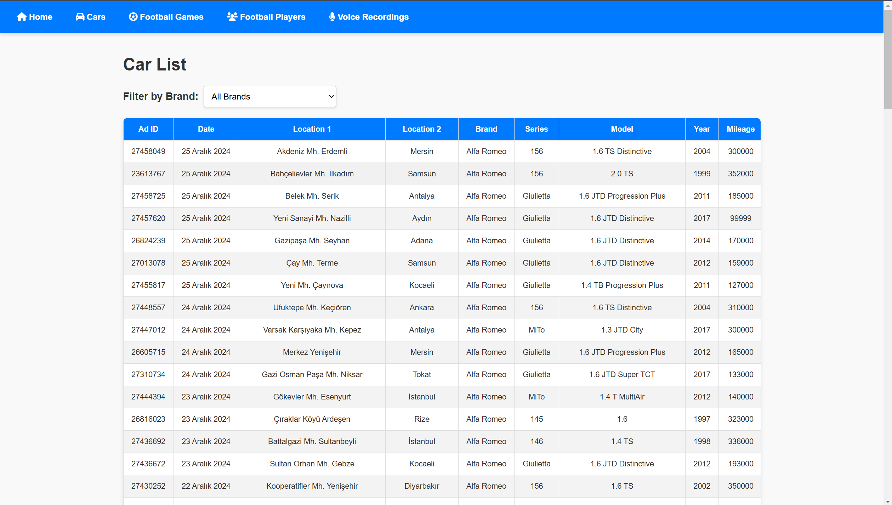

# Django Project: Cars, Football Games, Football Players, and Voices

Welcome to this Django-based web application that provides a structured platform to manage and view data for **Cars**, **Football Games**, **Football Players**, and **Voices**. This project includes fully functional web pages to interact with each model and demonstrates features like filtering, pagination, and file uploads.

---

### Features

1. **Cars Management**
   - Displays a list of cars with details like brand, model, year, and more.
   - Filtering capability based on the brand.
   - Pagination for easy navigation.

2. **Football Games**
   - View details of football games, including team names, scores, and match statistics.
   - Paginated list for efficient browsing.

3. **Football Players**
   - Detailed statistics and information about football players.
   - Pagination for large datasets.

4. **Voices**
   - Upload and manage audio files with metadata.
   - Most recent uploads are displayed first.

---

## Project Structure

- **Models**
  - `Car`: Handles car details such as brand, series, mileage, fuel type, etc.
  - `FootballGame`: Stores details about football games like teams, scores, and dates.
  - `FootballPlayer`: Tracks player statistics such as goals, assists, tackles, and more.
  - `Voice`: Manages audio files with upload functionality.

- **Views**
  - Home page (`/`)
  - Cars list (`/cars/`)
  - Football games list (`/football-games/`)
  - Football players list (`/football-players/`)
  - Voice management (`/voices/`)

---

## Screenshots

- Home Page: 
- Cars List Page: 
- Football Games Page: 
- Football Players Page: 
- Voices Page: 
---

## Installation

1. Clone the repository:
```bash
git clone https://github.com/YsK-dev/Data-software-development/tree/main/soft_eng.git
cd soft_eng
```

2. Install dependencies:
```bash
pip install -r requirements.txt
```

3. Run migrations:
```bash
python manage.py makemigrations
python manage.py migrate
```

4. Start the development server:
```bash
python manage.py runserver
```

5. Access the application at http://127.0.0.1:8000/.

--- 

## Usage

1. Home Page
* The home page serves as the entry point of the application.

2. Cars List Page
* View and filter cars based on brand. Supports pagination.

3. Football Games Page
* Browse a list of football games with scores and detailed match statistics.

4. Football Players Page
* Explore detailed player statistics for various football players.

5. Voices Page
* Upload and manage audio files. View recently uploaded files with pagination.
 
--- 

## Contributing
Fork the repository.
Create a feature branch (git checkout -b feature-branch).
Commit your changes (git commit -m 'Add feature').
Push to the branch (git push origin feature-branch).
Open a Pull Request.
